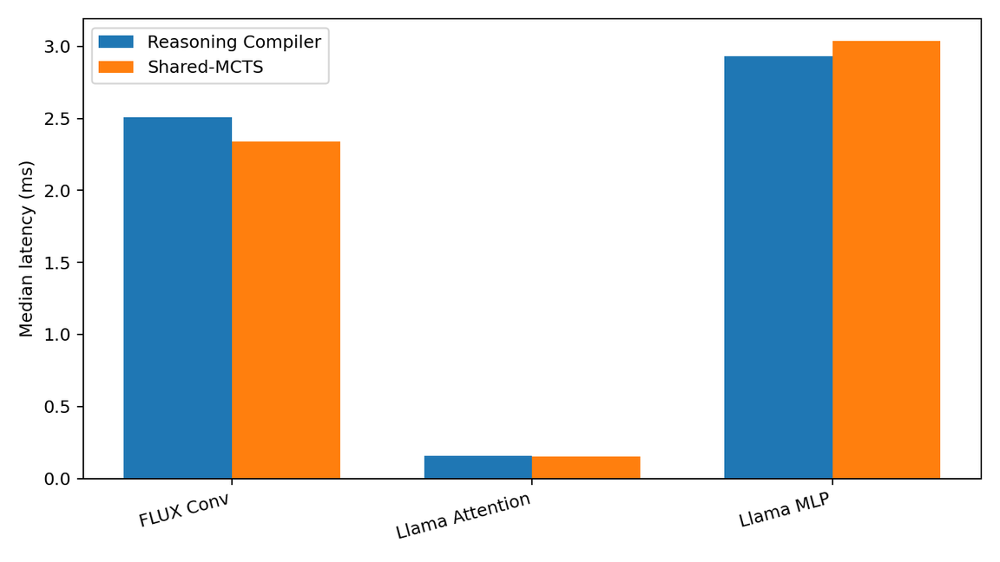
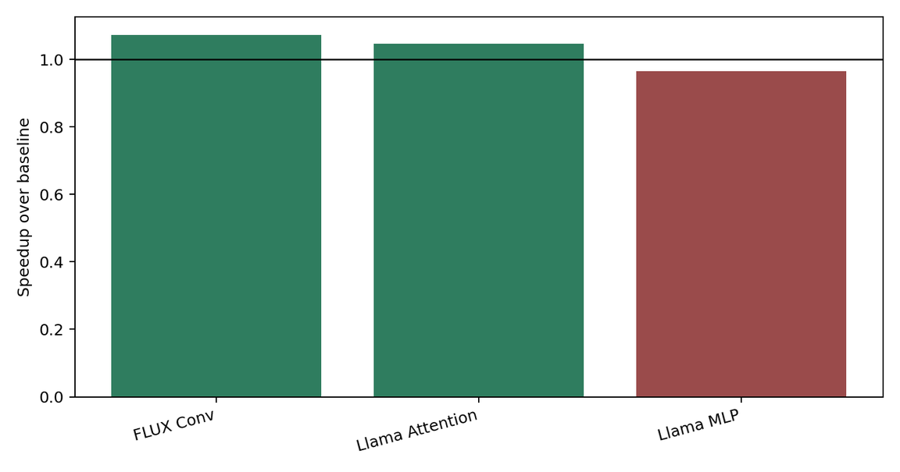

# Shared MCTS Compiler Optimization

This repository contains a course-scale project on shared-MCTS multi-model compiler optimization for TVM tensor programs. It extends the Reasoning Compiler direction with coordinated model selection during search.

This repository is intended for a graduate course project, not for claiming a full paper-scale reproduction.

## Key Takeaway

Shared-MCTS multi-model search improved latency on 2 out of 3 scaled-down Reasoning-Compiler-family TVM workloads, but did not reduce strong-model calls. The result supports selected-workload latency improvement, not cost saving.

## Keywords

TVM, tensor program optimization, LLM-guided compiler search, Monte Carlo Tree Search, multi-model routing, model-serving optimization, deep learning compiler

## Overview

This repository evaluates a shared-MCTS multi-model compiler-search strategy for TVM tensor programs. The study compares it against the official Reasoning Compiler implementation on scaled-down model-serving workloads under matched experimental settings.

## Method

The project starts from a compiler-search problem in TVM. Tensor programs have a large schedule transformation space, and choices such as tiling, fusion, vectorization, layout changes, unrolling, and parallelization are highly interdependent. A schedule choice that works well after one transformation may be poor after another, so compiler search can require many compile-and-measure samples.

Reasoning Compiler addresses this by using an LLM-guided MCTS search process. The LLM proposes schedule transformations from the current program state, transformation history, and performance feedback, while MCTS balances exploration and exploitation. The remaining limitation is model selection: a single strong model can provide better proposals but may be costly, while a smaller model can be cheaper but less reliable. A fixed single-model policy also cannot adapt model choice to the current search state.

This project evaluates a shared-MCTS multi-model search direction:

1. Use one shared MCTS tree across model calls so search history, failed candidates, and high-value schedules are reused.
2. Treat model choice as part of the search process rather than a fixed external setting.
3. Compare the resulting schedules against the official Reasoning Compiler baseline under matched workload, target, seed, trial budget, LLM budget, and measurement settings.

The intended improvement is in the compiler search process, not in the tensor operator definition or model accuracy. The evaluation checks whether the shared-search strategy changes the discovered TVM schedules and final measured latency.

## Reference

- REASONING COMPILER: LLM-Guided Optimizations for Efficient Model Serving
- Venue: NeurIPS 2025 poster
- Link: https://openreview.net/forum?id=2D4TuZyNnr

## What This Repository Is

- A course-scale implementation and evaluation of shared-MCTS multi-model compiler search.
- A matched comparison against the official Reasoning Compiler implementation on scaled-down TVM workloads.
- A system optimization project focused on compiler search behavior and latency.

## What This Repository Is Not

- It is not a full reproduction of the original Reasoning Compiler benchmark suite.
- It is not a claim that shared-MCTS search always outperforms Reasoning Compiler.
- It is not a GPU/CUDA performance claim.
- It is not a cost-saving claim.

## Why Scaled-down Workloads?

The public Reasoning Compiler repository did not include exact runnable configurations for the full benchmark workloads. To make a matched five-seed evaluation feasible for a course project, we preserved the operator structure of the workload families while reducing tensor dimensions.

These workloads are designed to represent the structure of attention, convolution, and MLP tensor programs, but they are not exact full-scale reproductions.

## Workloads

| Workload | Scaled-down definition |
|---|---|
| Llama-style Attention | `B=1, H=8, S=128, D=64`; QK matmul followed by AV matmul; softmax omitted |
| FLUX-style Convolution | `N=1, IC=128, H=64, W=64, OC=128, K=3, S=1, P=1` |
| Llama-style MLP | `T=128, H=512, I=2048`; gate projection, up projection, elementwise gate*up, down projection |

## Experimental Setup

The main experiment compares the official Reasoning Compiler implementation against the shared-MCTS multi-model search implementation under matched conditions.

| Item | Setting |
|---|---|
| Target | LLVM CPU |
| Seeds | `0, 1, 2, 3, 4` |
| Trials | `32` |
| LLM budget | `4` total LLM calls per tuning run, not per MetaSchedule trial |
| Comparison | Same workload, shape, target, trials, LLM budget, seeds, and measurement harness |
| Baseline | Official Reasoning Compiler implementation |
| Proposed method | Shared-MCTS / multi-model search |
| TVM import | Verified separately for both implementations |

## Results

All results are based on matched LLVM CPU experiments with five seeds, 32 trials, and a total LLM budget of 4 calls per tuning run.

| Workload | Reasoning Compiler median latency | Shared-MCTS median latency | Improvement |
|---|---:|---:|---:|
| scaled-down FLUX Conv | `2.508199 ms` | `2.338621 ms` | `+6.76%` |
| scaled-down Llama Attention | `0.157998 ms` | `0.151024 ms` | `+4.41%` |
| scaled-down Llama MLP | `2.932757 ms` | `3.039299 ms` | `-3.63%` |

Aggregate result:

| Metric | Result |
|---|---:|
| Faster workloads | `2 / 3` |
| Geomean speedup | `1.0268x` |
| Median latency improvement | `4.414%` |
| Strong-model call reduction | `0%` |
| Cost-saving claim | Not supported |

### Figures





## Interpretation

The shared-MCTS multi-model search improved median latency on 2 out of 3 scaled-down Reasoning-Compiler-family workloads. It achieved 6.76% improvement on the FLUX-style convolution workload and 4.41% improvement on the Llama-style attention workload.

However, it was 3.63% slower on the Llama-style MLP workload. Therefore, the result should be interpreted as selected-workload latency improvement, not universal superiority.

The experiment did not reduce strong-model calls. Therefore, this repository does not claim cost saving or strong-model call reduction.

## Repository Structure

```text
.
+-- bin/
|   +-- execute_matched_trial.py
|   +-- run_smoke_matrix.sh
|   +-- run_validation_matrix.sh
|   +-- aggregate_measurements.py
|   +-- render_figures.py
+-- kernels/
|   +-- model_serving_programs.py
+-- measurements/
|   +-- baseline_runs.csv
|   +-- coordinated_runs.csv
|   +-- paired_eval_table.csv
|   +-- validated_summary.csv
+-- figures/
+-- docs/
|   +-- operator_family_map.md
|   +-- matched_study_report.md
|   +-- korean_project_note.md
+-- requirements.txt
+-- LICENSE
+-- README.md
```

## Reproduction

The scripts expect two separate TVM environments:

- `BASELINE_TVM_HOME`: official Reasoning Compiler TVM source tree
- `COORDINATED_TVM_HOME`: shared-MCTS multi-model TVM source tree

`requirements.txt` only contains local plotting and result-processing dependencies. TVM and the two compiler-search implementations must be built separately.

Example:

```bash
pip install -r requirements.txt

export CUDA_VISIBLE_DEVICES=0
export BASELINE_TVM_HOME=/path/to/reasoning-compiler
export COORDINATED_TVM_HOME=/path/to/shared-mcts-tvm

TVM_HOME=$BASELINE_TVM_HOME \
PYTHONPATH=$BASELINE_TVM_HOME/python:$PYTHONPATH \
LD_LIBRARY_PATH=$BASELINE_TVM_HOME/build:$LD_LIBRARY_PATH \
TVM_LIBRARY_PATH=$BASELINE_TVM_HOME/build/libtvm.so \
python3 -c "import tvm; print(tvm.__version__, tvm.__file__)"

TVM_HOME=$COORDINATED_TVM_HOME \
PYTHONPATH=$COORDINATED_TVM_HOME/python:$PYTHONPATH \
LD_LIBRARY_PATH=$COORDINATED_TVM_HOME/build:$LD_LIBRARY_PATH \
TVM_LIBRARY_PATH=$COORDINATED_TVM_HOME/build/libtvm.so \
python3 -c "import tvm; print(tvm.__version__, tvm.__file__)"

bash bin/run_validation_matrix.sh
python3 bin/aggregate_measurements.py
python3 bin/render_figures.py
```

For more details, see:

- `docs/operator_family_map.md`
- `docs/matched_study_report.md`
- `docs/korean_project_note.md`

API keys are not stored in this repository. All latency numbers should be interpreted as course-scale experimental results, not full paper-scale reproduction results.

## License

This project is released under the MIT License.
